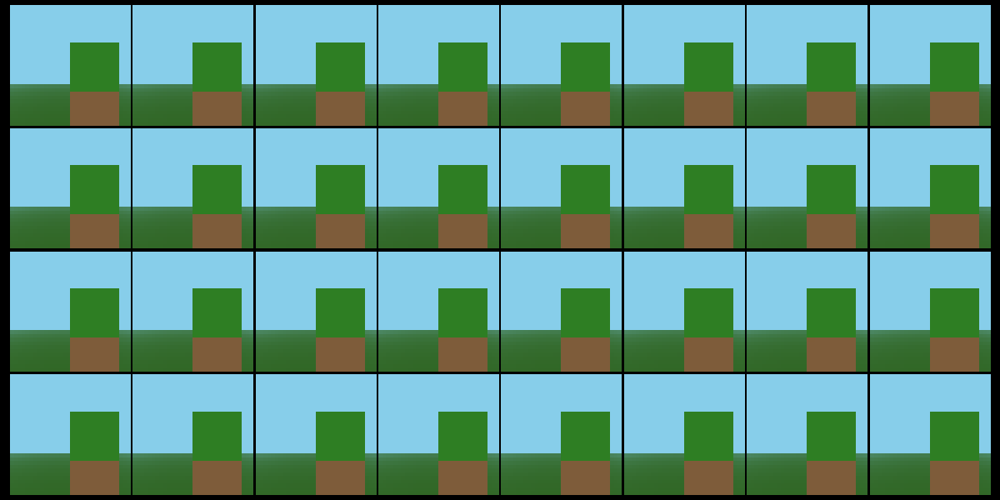
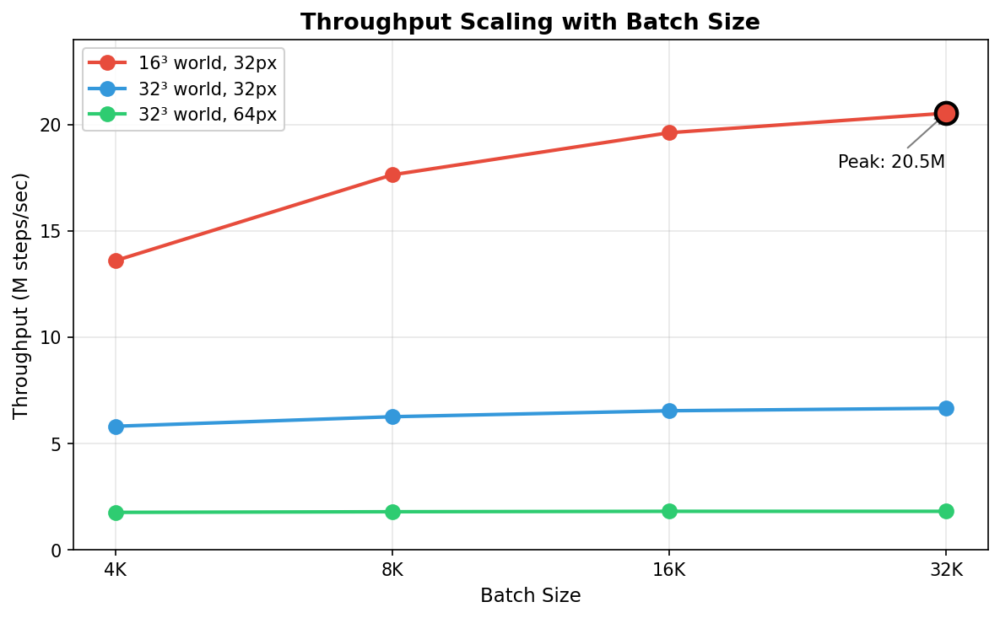
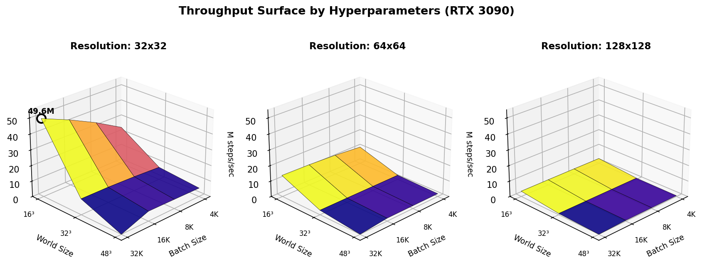

# mine.cu

High-performance batched voxel RL environment with custom CUDA kernels.



A minimal Minecraft-like environment designed for reinforcement learning research. All environment logic runs on GPU via custom CUDA kernels for maximum throughput.

## Features

- **Pure CUDA**: All rendering, physics, and game logic run on GPU
- **Batched**: Train thousands of agents in parallel
- **Fast**: Up to 20.5M environment steps per second on RTX 3090
- **Minimal**: Clean PyTorch integration, no JAX overhead
- **Zero-copy**: GPU tensors throughout, no CPU-GPU transfers

## Installation

Requirements:
- CUDA 12.8 toolkit (driver can be newer)
- PyTorch 2.0+
- Python 3.10+
- uv (recommended)

### Quick Setup (with uv)

```bash
git clone https://github.com/Infatoshi/mine.cu
cd mine.cu
./scripts/setup.sh
source .venv/bin/activate
```

### Manual Setup

```bash
git clone https://github.com/Infatoshi/mine.cu
cd mine.cu

# Create venv and install PyTorch with CUDA 12.8
uv venv --python 3.12
uv pip install torch numpy --index-url https://download.pytorch.org/whl/cu128

# Build with CUDA 12.8 (important if you have multiple CUDA versions)
CUDA_HOME=/usr/local/cuda-12.8 PATH=/usr/local/cuda-12.8/bin:$PATH uv pip install -e .
```

## Quick Start

```python
import torch
from minecu import MineEnv

# Create environment with 4096 parallel instances
env = MineEnv(batch_size=4096, device="cuda")

# Reset all environments
obs = env.reset()  # [4096, 64, 64, 3]

# Take random actions
for _ in range(100):
    actions = torch.randint(0, env.action_dim, (4096,), device="cuda")
    obs, rewards, dones = env.step(actions)
```

## Action Space

| Action | Description |
|--------|-------------|
| 0 | No-op |
| 1 | Move forward |
| 2 | Move backward |
| 3 | Strafe left |
| 4 | Strafe right |
| 5 | Jump |
| 6 | Break block |
| 7 | Look left |
| 8 | Look right |
| 9 | Look up |
| 10 | Look down |

## Environment Parameters

```python
env = MineEnv(
    batch_size=4096,       # Number of parallel environments
    world_size=32,         # Cubic world size (32x32x32 blocks)
    render_width=64,       # Observation width
    render_height=64,      # Observation height
    episode_length=60,     # Steps per episode (None for infinite)
    target_block=3,        # Block type for reward (3=wood log)
    reward_value=1.0,      # Reward for breaking target block
    device="cuda",
)
```

## Training Example

Train an agent to break wood using REINFORCE:

```bash
python examples/train_wood.py
```

See `examples/train_wood.py` for the full implementation.

## Visualization

Generate a video of agents playing:

```bash
python examples/visualize.py --output demo.mp4 --envs 8 --steps 200
```

## Throughput

Environment throughput depends on three main hyperparameters: batch size, world size, and render resolution. All benchmarks measured on RTX 3090.



Peak throughput of **20.5M steps/second** achieved with:
- `batch_size=32768`
- `world_size=16`
- `render_resolution=32x32`

### Hyperparameter Reference

| Parameter | Description | Impact |
|-----------|-------------|--------|
| `batch_size` | Parallel environment count | Higher is better until GPU saturates (sweet spot: 16K-32K) |
| `world_size` | Voxel world dimensions | Smaller worlds are faster (16 vs 32 vs 48) |
| `render_width/height` | Observation resolution | Major impact: 32px is 4x faster than 64px |
| `max_steps` | Raymarching iterations | Lower is faster but may cause visual artifacts |
| `view_distance` | Ray cutoff distance | Lower reduces wasted ray steps |

### Full Benchmark Results



| World | Resolution | Batch 4K | Batch 8K | Batch 16K | Batch 32K |
|-------|------------|----------|----------|-----------|-----------|
| 16x16x16 | 32x32 | 13.6M | 17.6M | 19.6M | **20.5M** |
| 16x16x16 | 64x64 | 5.1M | 5.4M | 5.5M | 5.6M |
| 16x16x16 | 128x128 | 1.5M | 1.5M | 1.5M | 1.5M |
| 32x32x32 | 32x32 | 5.8M | 6.3M | 6.5M | 6.7M |
| 32x32x32 | 64x64 | 1.8M | 1.8M | 1.8M | 1.8M |
| 32x32x32 | 128x128 | 0.5M | 0.5M | 0.5M | 0.5M |
| 48x48x48 | 32x32 | 4.4M | 4.7M | 4.8M | - |
| 48x48x48 | 64x64 | 1.4M | 1.4M | 1.4M | - |

### Configuration

All hyperparameters are centralized in `minecu/config.py`:

```python
from minecu import MineEnv, EnvConfig

# Use predefined fast config
from minecu.config import FAST_ENV
env = MineEnv.from_config(FAST_ENV)

# Or customize
config = EnvConfig(
    batch_size=32768,
    world_size=16,
    render_width=32,
    render_height=32,
    max_steps=32,
)
env = MineEnv.from_config(config)
```

### Memory Usage

Approximate GPU memory per configuration:

| Config | Voxels | Obs Buffer | Total |
|--------|--------|------------|-------|
| 4K batch, 32 world, 64px | 128 MB | 192 MB | ~400 MB |
| 16K batch, 32 world, 64px | 512 MB | 768 MB | ~1.5 GB |
| 32K batch, 16 world, 32px | 128 MB | 384 MB | ~800 MB |

## Architecture

```
mine.cu/
    src/
        kernels.cu       # CUDA kernels (render, physics, raycast)
        bindings.cpp     # PyTorch/pybind11 bindings
    minecu/
        __init__.py      # Python wrapper (MineEnv class)
        config.py        # Hyperparameter configuration
    examples/
        train_wood.py    # Training example
        visualize.py     # Visualization script
    scripts/
        setup.sh         # One-command setup
        plot_throughput.py  # Generate benchmark graphs
```

The rendering uses DDA raymarching. Physics handles movement, gravity, and collision. Block breaking uses raycasting from the player's view direction.

## Block Types

| ID | Block |
|----|-------|
| -1 | Air |
| 0 | Grass |
| 1 | Dirt |
| 2 | Stone |
| 3 | Oak Log |
| 4 | Leaves |
| 5 | Sand |
| 6 | Water |
| 7 | Glass |
| 8 | Brick |
| 9 | Cobblestone |
| 10 | Planks |
| 11 | Snow |
| 12 | Bedrock |

## Citation

```bibtex
@software{minecu2026,
  author = {Infatoshi},
  title = {mine.cu: High-Performance Batched Voxel RL Environment},
  year = {2026},
  url = {https://github.com/Infatoshi/mine.cu}
}
```

## License

MIT
